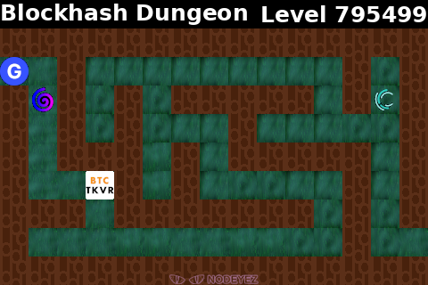

# Blockhash Dungeon

This script produces a maze reminiscent of legacy videogame systems based on the
Bitcoin Blockhash.  The maze is rendered semi deterministically and features
custom tilesets for the maze floor and walls, and logos of popular entities in
the Bitcoin ecosystem. It depends on a bitcoin node.



## Script Location

The script is installed at 
[~/nodeyez/scripts/blockhashdungeon.py](../scripts/blockhashdungeon.py). 

## Configuration

To manage and configure this script, use the nodeyez-config tool

```sh
sudo nodeyez-config
```

To manually configure this script, edit the `~/nodeyez/config/blockhashdungeon.json` file

Fields are defined below

| field name | description |
| --- | --- |
| backgroundColor | The background color of the image expressed as a hexadecimal color specifier. Default `#000000` |
| bitcoinLogosFile | The path to a file containing tiles of logos to overlay on the maze with dimensions 32x32 pixels, 16 icons wide. Default `../images/blockhash-dungeon-bitcoin-logos.png` |
| bitcoinTilesFile | The path to a file containing tiles with dimensions 32x32 arranged in sets of 8 tiles per theme, two themes wide, and 11 themes high. Default `../images/blockhash-dungeon-bitcoin-tiles.png` |
| height | The height, in pixels, to generate the image. Default `320` |
| interval | The amount of time, in seconds, the script should wait before data gathering and image creation again. Default `300` |
| textColor | The color of the text expressed as a Hexadecimal color specifier. Default `#ffffff` |
| width | The width, in pixels, to generate the image. Default `480` |

## Run Directly

Ensure the virtual environment is activated
```shell
source ~/.pyenv/nodeyez/bin/activate
```

Change to the scripts folder
```shell
cd ~/nodeyez/scripts
```

And run it
```shell
python blockhashdungeon.py
```

Press CTRL+C to stop the process

## Run at Startup

To enable the script to run at startup, as the privileged user run the following

```shell
sudo systemctl enable nodeyez-blockhashdungeon.service

sudo systemctl start nodeyez-blockhashdungeon.service
```

---

[Home](../) | 