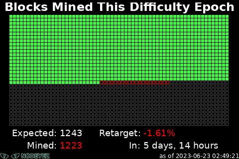

# Difficulty Epoch

This script will query the local bitcoin node and prepare an image representing
the number of blocks that have been mined thus far in the current difficulty
epoch, and indicate if the pace is ahead of schedule or behind, with an 
estimated difficulty adjustment to occur when the next epoch begins. Each
difficulty epoch consists of 2016 blocks. 

It depends on a bitcoin node running locally and fully synched.



## Script Location
The script is installed at
[../scripts/difficultyepoch.py](../scripts/difficultyepoch.py).

## Configuration

To configure this script override the default configuration as follows

```shell
nano ../config/difficultyepoch.json
```

| field name | description |
| --- | --- |
| outputFile | The path to save the generated image. Default `../imageoutput/difficultyepoch.png` |
| colorTextFG | The color of the text expressed as a Hexadecimal color specifier. Default `#ffffff` |
| colorBackground | The background color of the image expressed as a hexadecimal color specifier. Default `#000000` |
| colorGrid | The base color of the grid representing each block during the difficulty period, expressed as a Hexadecimal color specifier. Default `#404040` |
| colorAhead | The color to fill in the block when ahead of schedule, expressed as a Hexadecimal color specifier. Default `#ffff40` |
| colorBehind | The color to draw the grid for a block when its not yet mined and was expected to be, expressed as a Hexadecimal color specifier. Default `#ff0000` |
| colorMined | The color to fill in the block when it has been mined by the time expected, expressed as a Hexadecimal color specifie. Default `#40ff40` |
| saveEachBlock | Indicates whether the result for each block should be saved as a separate image. Useful as source for animated composites. Default `false` |
| width | The width, in pixels, to generate the image. Default `480` |
| height | The height, in pixels, to generate the image. Default `320` |
| sleepInterval | The amount of time, in seconds, the script should wait before data gathering and image creation again. Default `540` |

After making changes, Save (CTRL+O) and Exit (CTRL+X) nano.


## Run Directly

To run this script

Ensure the virtual environment is activated

```shell
source ~/.pyenv/nodeyez/bin/activate
```

And then run it

```shell
cd ~/nodeyez/scripts

python difficultyepoch.py
```

Press CTRL+C to stop the process


## Run at Startup

To enable the script to run at startup, as the privileged user run the following

```shell
sudo systemctl enable nodeyez-difficultyepoch.service

sudo systemctl start nodeyez-difficultyepoch.service
```

---

[Home](../) | 

