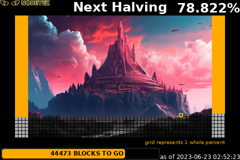

# Halving Countdown

This script will prepare an image representing the progress towards the next
subsidy halving depicted as a progress bar, and each block mined within the 
current whole number percent.  Since a halving period is 210000 blocks, each
whole percent represents 2100 blocks making for a nice layout.

It depends on a bitcoin node.



## Script Location

The script is installed at 
[~/nodeyez/scripts/halving.py](../scripts/halving.py).

## Configuration

To manage and configure this script, use the nodeyez-config tool

```sh
sudo nodeyez-config
```

To manually configure this script, edit the `~/nodeyez/config/halving.json` file

Fields are defined below

| field name | description |
| --- | --- |
| backgroundColor | The background color of the image expressed as a hexadecimal color specifier. Default `#000000` |
| blockclockEnabled | Indicates whether results should be sent to a blockclock. Default `false` |
| blockclockAddress | The IP address of the blockclock on your network. Default `21.21.21.21` |
| blockclockPassword | The password for the blockclock on your network, leave blank for no password. Default is unset |
| gridColor | The base color of the grid representing each block for this period, expressed as a Hexadecimal color specifier. Default `#404040` |
| gridDividerFillEnabled | This controls whether the lines between individual grid blocks should be filled as well when blocks are produced. Default `true` |
| gridImageEnabled | Indicates whether to render a graphic image into the grid. If enabled, will source images from the ipfsDirectory location, changing to a different image for each whole percent. Default `True` |
| gridImageUnminedMode | When gridImageEnabled is True, this controls how unmined blocks should appear. Supported values are: fullcolor, grayscale, dither, dither2. Default `grayscale` |
| height | The height, in pixels, to generate the image. Default `320` |
| interval | The amount of time, in seconds, the script should wait before data gathering and image creation again. Default `540` |
| progressColor | The color to fill in blocks and draw the progress bar itself, expressed as a Hexadecimal color specifie. Default `#40ff40` |
| textColor | The color of the text expressed as a Hexadecimal color specifier. Default `#ffffff` |
| width | The width, in pixels, to generate the image. Default `480` |

## Run Directly

Ensure the virtual environment is activated
```shell
source ~/.pyenv/nodeyez/bin/activate
```

Change to the scripts folder
```shell
cd ~/nodeyez/scripts
```

Run it
```shell
python halving.py
```

Press CTRL+C to stop the process

## Run at Startup

To enable the script to run at startup, as the privileged user run the following

```shell
sudo systemctl enable nodeyez-halving.service

sudo systemctl start nodeyez-halving.service
```

---

[Home](../) | 