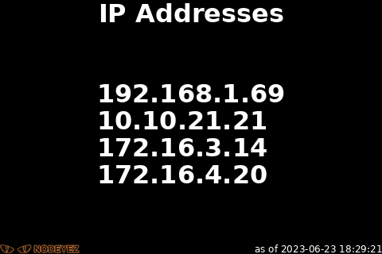

# IP Addresses

This script prepares an image enumerating the IP Addresses of the host
limited to IPv4 addresses.  

This can be especially useful to raspberry pi operators using an attached
screen that setup their device to use DHCP vs a statically assigned IP 
from their router. As the IP addresses changes, the images generated can 
reflect such changes affording easier ability to login over local network.
It can also be helpful to see what IP addresses are bound as listeners for
local virtual networks typically setup with Docker.



## Script Location

The script is installed at
[~/nodeyez/scripts/ipaddresses.py](../scripts/ipaddresses.py).

## Configuration

To manage and configure this script, use the nodeyez-config tool

```sh
sudo nodeyez-config
```

To manually configure this script, edit the `~/nodeyez/config/ipaddresses.json` file

Fields are defined below

| field name | description |
| --- | --- |
| backgroundColor | The background color of the image expressed as a hexadecimal color specifier. Default `#000000` |
| height | The height, in pixels, to generate the image. Default `320` |
| interval | The amount of time, in seconds, the script should wait before data gathering and image creation again. Default `120` |
| textColor | The color of the text expressed as a hexadecimal color specifier. Default `#ffffff` | 
| width | The width, in pixels, to generate the image. Default `480` |

## Run Directly

Ensure the virtual environment is activated
```shell
source ~/.pyenv/nodeyez/bin/activate
```

Change to the script folder
```shell
cd ~/nodeyez/scripts
```

Run it
```shell
python ipaddresses.py
```

Press CTRL+C to stop the process

## Run at Startup

To enable the script to run at startup, as the privileged user run the following

```shell
sudo systemctl enable nodeyez-ipaddresses.service

sudo systemctl start nodeyez-ipaddresses.service
```

---

[Home](../) | 