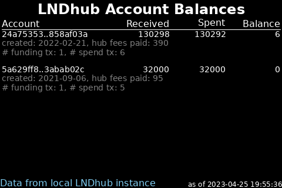

# LND Hub Account Balances

This script is useful if you are operating a local intance of LND Hub to
support your own lightning wallets like BlueWallet connected to your node
or if you are acting as a "bank" for friends and family who dont have their
own node.  

Lightning server implementations generally only provide a per channel 
balance, or the overall wallet balance for the server as they are
unaware of subaccounts.  This can cause challenges if you don't know how
much of the server balance belongs to others vs yourself when using general
tools like Ride the Lightning, Thunderhub, Zeus LN that operate at the
server level.

With this script, you can produce a summary of all accounts in the system,
the total funds they have received and spent through invoices, and their
balance.

Optionally, further metadata for users, such as the date their account was
created, total fees paid to the hub, and number of funding and spending
transactions may also be displayed.



The script limits output to that which will fit on a single screen, which
should allow for anywhere from about 4 to 8 accounts.  If you need
pagination support for more accounts, please file an issue or contact
me directly.

## Script Location

This script is installed at
[/home/nodeyez/nodeyez/scripts/lndhub.py](../scripts/lndhub.py).

## Configuration

To configure this script override the default configuration as follows

```shell
nano /home/nodeyez/nodeyez/config/lndhub.json
```

| field name | description |
| --- | --- |
| outputFile | The path to save the generated image. Default `/home/nodeyez/nodeyez/imageoutput/lndhub.png` |
| width | The width, in pixels, to generate the image. Default `480` |
| height | The height, in pixels, to generate the image. Default `320` |
| sleepInterval | The amount of time, in seconds, the script should wait before data gathering and image creation again. Default `600` |
| colorBackground | The background color of the image expressed as a hexadecimal color specifier. Default `#000000` |
| colorTextFG | The color of the text expressed as a Hexadecimal color specifier. Default `#ffffff` |
| colorTextDark | The color of the account detail text expressed as a Hexadecimal color specifier. Default `#808080` |
| colorLine | The color of the line dividing the subheader from user records expressed as a Hexadecimal color specifier. Default `#4040ff` |
| redisServer | The hostname of the redis server. Default `localhost` |
| redisPort | The port of the redis server. Default `6379` |
| redisDb | The redis database number to load. Default `0` |
| enableUserDetails | Indicates whether user details should be output to the image (create date, hub fees, txs). Default `true` |
| enableLogDetails | Indicates whether the debug info should be printed out. Default `true` |

Any additional field names and values can be used to associate an alias to an internal user id within redis.

For example, for a user account identified as f9095b00b85802c6ff9cc674231858af03a24a75353aa7c0, you can add a json
snippet in the config file as follows

```json
"f9095b00b85802c6ff9cc674231858af03a24a75353aa7c0": "Samantha"
```

After making changes, Save (CTRL+O) and Exit (CTRL+X) nano.

## Run Directly

* To run this script

```shell
cd /home/nodeyez/nodeyez/scripts
/usr/bin/env python3 lndhub.py
```

Press CTRL+C to stop the process

## Run at Startup

To enable the script to run at startup, as the privileged user run the following

```shell
sudo systemctl enable nodeyez-lndhub.service
sudo systemctl start nodeyez-lndhub.service
```

---

[Home](../) | 

