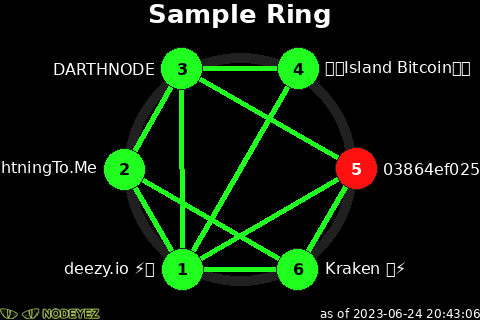

## Ring of Fire Status

The Ring of Fire script provides renderings of configured Lightning Ring of Fire
groups.  If you have a lightning node and participate in a Ring of Fire, you can
configure the pubkeys for each node in the agreed sequence and the script 
will provide a useful image showing its present state.  

Color coding differentiates an online node from an offline one, as well as the
channels between them. Names of nodes can be labeled on the resulting image for
context. You can define as many ring of fire configurations as you want. 



## Script Location

The script is installed at 
[~/nodeyez/scripts/lndringoffire.py](../scripts/lndringoffire.py)

## Configuration

To manage and configure this script, use the nodeyez-config tool

```sh
sudo nodeyez-config
```

To manually configure this script, edit the `~/nodeyez/config/lndringoffire.json` file

Fields are defined below

| field name | description  |
| --- |--- |
| headerText | The text to use in the header area. This can be overriden in each ring definition. Default `Lightning Ring of Fire` |
| height | The height, in pixels, to generate the image. Default `320` |
| interval | The amount of time, in seconds, the script should wait before data gathering and image creation again. Default `900` |
| nodeOfflineBackgroundColor | The background color to depict an offline node. Default `#ff1010` |
| nodeOfflineTextColor | The text color to use for labeling an offline node. Default `#ffffff` |
| nodeOnlineBackgroundColor | The background color to depict an online node. Default `#20ff20` |
| nodeOnlineTextColor | The text color to use for labeling an online node. Default `#000000` |
| ringColor | The color to render the ring. Default `#202020` |
| rings | An array collection of defined rings to monitor and produce images for. The structure is defined below. |
| width | The width, in pixels, to generate the image. Default `480` |

__rings__

| field name | description |
| --- | --- |
| enabled | Indicates whether this ring configuration is enabled for monitoring. Default `true` |
| headerText | Override the default text in the header area to label the ring. Default `Sample ring` |
| id | A unique identifier for the ring to be used in logging and constructing image files. Default `sample` |
| nodes | An array of node objects where each represents a lightning node participant in this ring, in order. The structure is defined below |

__node__

| field name | description |
| --- | --- |
| pubkey | The public key to the node |
| operator | A short label to identify the node |


## Run Directly

Ensure the virtual environment is activated
```shell
source ~/.pyenv/nodeyez/bin/activate
```

Change to the scripts folder
```shell
cd ~/nodeyez/scripts
```

Run it
```shell
python lndringoffire.py
```

Press CTRL+C to stop the process

## Run at Startup

To enable the script to run at startup, as the privileged user run the following

```shell
sudo systemctl enable nodeyez-lndringoffire.service

sudo systemctl start nodeyez-lndringoffire.service
```

---

[Home](../) | 