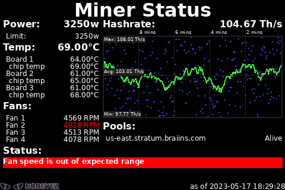

# Miner

This script is useful if you have one or more Bitcoin miners running a
supported configuration.  It prepares an image showing the power, 
temperature, fan and pool info along with a graph of the hashrate produced
overtime with moving average and warning thresholds.  

This is a merge of prior miner scripts and may support the following
- Miners running Braiins OS
- MicroBT Whatsminers
- Antminer S19



## Script Location

The script is installed at
[~/nodeyez/scripts/miner.py](../scripts/miner.py).

## Configuration

To manage and configure this script, use the nodeyez-config tool

```sh
sudo nodeyez-config
```

To manually configure this script, edit the `~/nodeyez/config/miner.json` file

Fields are defined below

| field name | description |
| --- | --- |
| backgroundColor | The background color of the image expressed as a hexadecimal color specifier. Default `#000000` |
| hashrateBoxColor | The color of the border, average line and label backgrounds for the hashrate graph expressed as a Hexadecimal color specifier. Default `#202020` |
| hashrateLowValueColor | The color to chart hashrate values that are below expected threshold. Default `#ffaa00` |
| hashrateLowValueTextColor | The color to draw the annotation text on the chart if hashrate value below threshold. Default `#202020` |
| hashrateMovingAverageColor | The color to draw the hashrate moving average line expressed as a Hexadecimal color specifier. Default `#40ff40` |
| hashrateValueColor | The color to plot each hashrate value within the hashrate graph expressed as a Hexadecimal color specifier. Default `#2f3fc5` |
| headerText | The text to use in the header area. This can be overriden in each ring definition. Default `Miner Status` |
| height | The height, in pixels, to generate the image. Default `320` |
| interval | The amount of time, in seconds, the script should wait before data gathering and image creation again. Default `60` |
| miners | An array of one or more miners. The structure of a miner is defined below |
| textColor | The color of the text expressed as a Hexadecimal color specifier. Default `#ffffff` |
| warningColor | The color to show the temperature exceeding the hot threshold expressed as a Hexadecimal color specifier. Default `#ffaa00` |
| warningStatusBackgroundColor | The color to show the background of the status area when an expectation is not met. Default `#ff0000` |
| warningStatusTextColor | The color to show the warning text when an expectation is not met. Default `#ffffff` |
| width | The width, in pixels, to generate the image. Default `480` |

__miner__

| field name | description |
| --- | --- |
| enabled | Indicates whether this miner configuration is enabled for monitoring |
| address | *required* The ip or host address for your miner on your local lan, accessible from the host running the script. Default `127.0.0.1` |
| headerText | Override the default text in the header area for the miner. Default `Miner Status` |
| port | The port the miner is listening for readonly requests on. Default `4028` |
| type | The type of miner. Additional types will be supported as information is provided. Supported values are: detect, antminer-s19, braiins, microbt. Default `detect` |
| expectations | Define expected normal operating thresholds. This does not configure the miner, but is used for indicating if a value is out of range.. The structure is defined below |

__expectations__

| field name | description |
| --- | --- |
| Boards | Expected ambient and chip temperatures. The structure is defined below. |
| Fans | Expected fan speed range. The structure is defined below. |
| Hashrate | Expected hashrate. The structure is defined below. |
| Pools | Expected pool settings. The structure is defined below. |
| Power | Expected power consumption. The structure is defined below. |

__Boards__

| field name | description |
| --- | --- |
| TempMin | Lower range of expected board temperature in Celsius. Default `40` |
| TempMax | Upper range of expected board temperature in Celsius. Default `65` |
| ChipTempMin | Lower range of expected chip temperature in Celsius. Default `40` |
| ChipTempMax | Upper range of expected chip temperature in Celsius. Default `90` |

__Fans__

| field name | description |
| --- | --- |
| Min | Lower range of expected fan speed, in RPMs. Default `1800` |
| Max | Upper range of expected fan speed, in RPMs. Default `4800` |

__Hashrate__

| field name | description |
| --- | --- |
| Min | Lower range of expected hashrare, in Mh/s. Default `61500000` |

__Pools__

| field name | description |
| --- | --- |
| URL | The url for a pool that is expected to be configured. Default `stratum+tcp://us-east.stratum.braiins.com:3333` |
| User | The user that is expected for the pool. You may end with .* for any worker name. Default `BobbiesHashingEmporium.*` |

__Power__

| field name | description |
| --- | --- |
| Min | The low end of expected power range, in watts. Default `1875` |
| Max | The high end of expected power range, in watts. Default `3400` |

## Run Directly

Ensure the virtual environment is activated
```shell
source ~/.pyenv/nodeyez/bin/activate
```

Change to the scripts folder
```shell
cd ~/nodeyez/scripts
```

Run it
```shell
python miner.py
```

Press CTRL+C to stop the process

## Run at Startup

To enable the script to run at startup, as the privileged user run the following

```shell
sudo systemctl enable nodeyez-miner.service

sudo systemctl start nodeyez-miner.service
```

---

[Home](../) | 