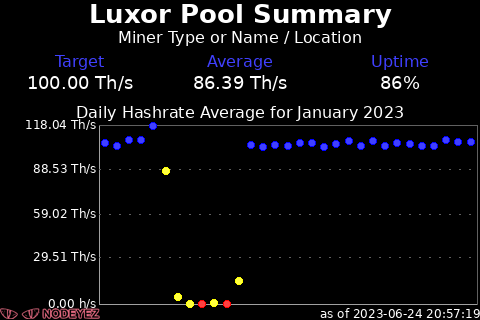

# Luxor Mining Pool

This script prepares images for each month of hashrate data available for your
Luxor Tech mining pool account.



## Script Location

The script is installed at
[~/nodeyez/scripts/luxor-mining-hashrate.py](../scripts/luxor-mining-hashrate.py).

## Configuration

To manage and configure this script, use the nodeyez-config tool

```sh
sudo nodeyez-config
```

To manually configure this script, edit the `~/nodeyez/config/miningpool-luxorpool.json` file

Fields are defined below

- You must have an account with [Luxor](https://beta.luxor.tech/) and an
  API Key for that account. Read only access is sufficient

| field name | description |
| --- | --- |
| apikey | Your api key for your Luxor account. |
| backgroundColor | The background color of the image expressed as a hexadecimal color specifier. Default `#000000` |
| dataValueColor | The color of the text values for major categories expressed as a Hexadecimal color specifier. Default `#4040ff` | 
| graphLineDarkColor | The color to use for the right and top borders of the blot graph, expressed as a Hexadecimal color specifier. Default `#606060` |
| graphLineLightColor | The color to use for the left and bottom borders of the plot graph, expressed as a Hexadecimal color specifier. Default `#a0a0a0` |
| hashrateNormalDotFillColor | The color to plot a dot for the hashrate when normal at a point in time expressed as a Hexadecimal color specifier. Default `#4040ff` |
| hashrateNormalDotOutlineColor | The color to make the outline of plotted dots for normal hashrate expressed as a Hexadecimal color specifier. Default `#0000ff` |
| hashrateLowDotFillColor | The color to plot a dot for the hashrate when it below the low threshold at a point in time expressed as a Hexadecimal color specifier. Default `#ffff40` |
| hashrateLowDotOutlineColor | The color to make the outline of plotted dots for low hashrate expressed as a Hexadecimal color specifier. Default `#ffff00` |
| hashrateLowThreshold | The hashrate level for which hashing should be considered low. Default `90000000000000` | 
| hashrateTarget | The hashrate per second for the expected miner output. Default `110000000000000` |
| hashrateZeroDotFillColor | The color to plot a dot for the hashrate when it is zero/unreported at a point in time expressed as a Hexadecimal color specifier. Default `#ff4040` |
| hashrateZeroDotOutlineColor | The color to make the outline of plotted dots for zero/unreported hashrate expressed as a Hexadecimal color specifier. Default `#ff0000` | 
| height | The height, in pixels, to generate the image. Default `320` |
| interval | The amount of time, in seconds, the script should wait before data gathering and image creation again. Default `86400` |
| movingAverageColor | The color to use for the moving average line expressed as a Hexadecimal color specifier. Default `#40ff40` |
| subheadingText | A label beneath the main header useful for identifying the miner. Default `S19 Pro 110TH` |
| textColor | The color of the text expressed as a Hexadecimal color specifier. Default `#ffffff` |
| username | Your username for your Luxor account. |
| width | The width, in pixels, to generate the image. Default `480` |

## Run Directly

Ensure the virtual environment is activated
```shell
source ~/.pyenv/nodeyez/bin/activate
```

Change to the scripts folder
```shell
cd ~/nodeyez/scripts
```

Run it
```shell
python miningpool-luxorpool.py
```

Press CTRL+C to stop the process

## Run at Startup

To enable the script to run at startup, as the privileged user run the following

```shell
sudo systemctl enable nodeyez-miningpool-luxorpool.service

sudo systemctl start nodeyez-miningpool-luxorpool.service
```

---

[Home](../) | 