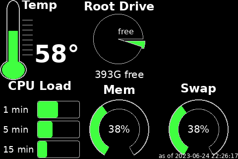

# System Information

A useful script that reports the CPU temperature and load, drive space in use 
and free, as well as memory usage.  Color coding follows green/yellow/red for
ranging from all OK to heavy usage to warning.



This script assumes you are using a Raspberry Pi setup using a MicroSD card for
the OS (/dev/root), and external storage (/dev/sda1) for data files for Bitcoin,
LND, etc.

## Script Location

This script is installed at
[~/nodeyez/scripts/sysinfo.py](../scripts/sysinfo.py)

## Configuration

To manage and configure this script, use the nodeyez-config tool

```sh
sudo nodeyez-config
```

To manually configure this script, edit the `~/nodeyez/config/sysinfo.json` file

Fields are defined below

| field name | description |
| --- | --- |
| backgroundColor | The background color of the image expressed as a hexadecimal color specifier. Default `#000000` |
| height | The height, in pixels, to generate the image. Default `320` |
| interval | The amount of time, in seconds, the script should wait before data gathering and image creation again. Default `30` |
| width | The width, in pixels, to generate the image. Default `480` |

## Run Directly

Ensure the virtual environment is activated
```shell
source ~/.pyenv/nodeyez/bin/activate
```

Change to the scripts folder
```shell
cd ~/nodeyez/scripts
```

Run it
```shell
python sysinfo.py
```

Press CTRL+C to stop the process

## Run at Startup

To enable the script to run at startup, as the privileged user run the following

```shell
sudo systemctl enable nodeyez-sysinfo.service

sudo systemctl start nodeyez-sysinfo.service
```

---

[Home](../) | 