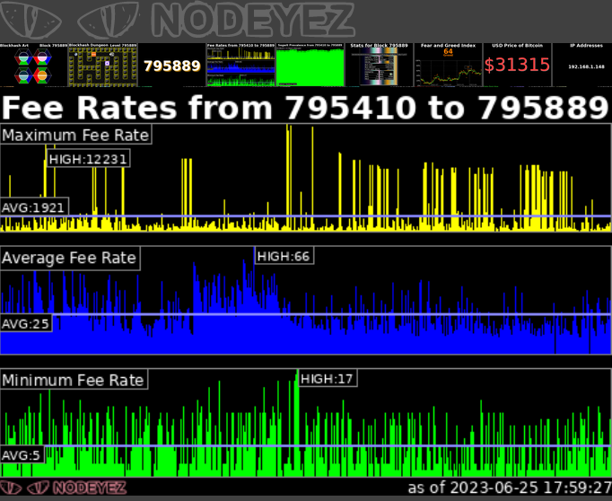

# Website Dashboard

Whether you are using a display screen or not, you can also make the images 
viewable via website dashboard.  The dashboard included in nodeyez looks like
this



The dashboard view will automatically cycle through the same images at 10 second
intervals, showing smaller versions at the top of the screen.  

Clicking on an image will automatically advance the view to the full size 
version of that one.

There are multiple options for setting up the dashboard.  Choose the most
appropriate based on your raspberry pi node

If you are currently logged in as user nodeyez, `exit` back to the privileged user.

## Choose ONE (1) of the following

- [Install for MyNodeBTC](#install-for-mynodebtc)
- [New Install of NGINX](#new-install-of-nginx)
- [Modifying Existing NGINX Setup](#modifying-existing-nginx-setup)

## Install for MyNodeBTC

<mash-accordion markdown="1" key="nbcweb1" resource="549a2981-ae65-41e3-b620-6b22bec143cd" button-horizontal-align="center" button-vertical-align="bottom" button-text="Read More" button-variant="solid" button-size="md" loading-indicator-size="14">

<div markdown="1">

If you are using [MyNodeBTC](https://mynodebtc.com/), then you can follow 
this section.  MyNodeBTC already comes with NGINX and will update over top of 
configuration files. Thankfully, it also makes use of the sites-enabled and 
[reverse-proxy](https://docs.nginx.com/nginx/admin-guide/web-server/reverse-proxy/) 
features to make this a little easier.

* Copy necessary files for NGINX

We want to enable the XSLT module, create a definition for the Nodeyez 
dashboard on port 907, and our template that generates the dashboard view.

```shell
sudo cp /home/nodeyez/nodeyez/scripts/nginx/a_xslt.conf /etc/nginx/modules-enabled/a_xslt.conf

sudo cp /home/nodeyez/nodeyez/scripts/nginx/https_nodeyez.conf /etc/nginx/sites-enabled/https_nodeyez.conf

sudo cp /home/nodeyez/nodeyez/scripts/nginx/nodeyez*.xslt /etc/nginx/

sudo chown root:root /etc/nginx/modules-enabled/a_xslt.conf

sudo chown root:root /etc/nginx/sites-enabled/https_nodeyez.conf

sudo chown root:root /etc/nginx/nodeyez*.xslt
```

* Test the NGINX configuration and restart the service.

There should be no errors when running the test with the first command.

```shell
sudo nginx -t

sudo systemctl restart nginx
```
  
* Enable Access Through Firewall

```shell
sudo ufw allow 907 comment 'allow access to nodeyez images over ssl'
```
 
Now see if you can access the dashboard at https://your-node-ip:907

[Continue to Running Services at Startup]()

</div>

</mash-accordion>


## New Install of NGINX

<mash-accordion markdown="1" key="nbcweb2" resource="549a2981-ae65-41e3-b620-6b22bec143cd" button-horizontal-align="center" button-vertical-align="bottom" button-text="Read More" button-variant="solid" button-size="md" loading-indicator-size="14">

<div markdown="1">

If you dont yet have nginx setup, the steps here will guide you for the installation
and basic configuration of the web server.

```shell
sudo apt install -y nginx
```

* Create a self-signed TLS certificate (valid for 10 years)

```shell
sudo openssl req -x509 -nodes -newkey rsa:2048 -keyout /etc/ssl/private/nodeyez-nginx-selfsigned.key -out /etc/ssl/certs/nodeyez-nginx-selfsigned.crt -subj "/CN=localhost" -days 3650
```

* Drop in our config

```shell
sudo cp /home/nodeyez/nodeyez/scripts/nginx/a_xslt.conf /etc/nginx/modules-enabled/a_xslt.conf

sudo chown root:root /etc/nginx/modules-enabled/a_xslt.conf

sudo cp /home/nodeyez/nodeyez/scripts/nginx/nodeyez*.xslt /etc/nginx/

sudo chown root:root /etc/nginx/nodeyez*.xslt

sudo mkdir -p /etc/nginx/nodeyez

sudo cp /home/nodeyez/scripts/nginx/nodeyez_ssl*.conf /etc/nginx/nodeyez

sudo cp /home/nodeyez/nodeyez/scripts/nginx/https_nodeyez.conf /etc/nginx/sites-enabled/https_nodeyez.conf

sudo chown root:root /etc/nginx/sites-enabled/https_nodeyez.conf
```

* Test the NGINX configuration and restart the service.

```shell
sudo nginx -t

sudo systemctl restart nginx
```

* Enable Access Through Firewall

```shell
sudo ufw allow 907 comment 'allow access to nodeyez images over ssl'
```
 
Now see if you can access the dashboard at https://your-node-ip:907

You can also get to lists of files in the data directory at https://your-node-ip:907/data/

And view a specific subfolder of data as a photo album at https://your-node-ip:907/album/

[Continue to Running Services at Startup]()

</div>

</mash-accordion>


## Modifying Existing NGINX setup

<mash-accordion markdown="1" key="nbcweb3" resource="549a2981-ae65-41e3-b620-6b22bec143cd" button-horizontal-align="center" button-vertical-align="bottom" button-text="Read More" button-variant="solid" button-size="md" loading-indicator-size="14">

<div markdown="1">

If you already have nginx installed, then you'll need to make some configuration
decisions based on the existing configuration

First, capture any existing SSL certificate paths
```shell
line_ssl_certificate=$(sudo nginx -T 2>&1 | grep "ssl_certificate " | sed -n 1p)

line_ssl_certificate_private=$(sudo nginx -T 2>&1 | grep "ssl_certificate_private " | sed -n 1p)
```
If there is an existing ssl certificate and key, we will reference it later.

The Nodeyez Website Dashboard depends on using XSLT templates for generating a
directory listing. To support this, the XSLT module must be enabled.

Check if its enabled already.
```shell
sudo nginx -T 2>&1 | grep "xslt"
```

If there is no response, then xslt filter module is not yet loaded. Add it
as follows
```shell
sudo cp /home/nodeyez/nodeyez/scripts/nginx/a_xslt.conf /etc/nginx/modules-enabled/a_xslt.conf

sudo chown root:root /etc/nginx/modules-enabled/a_xslt.conf
```

Next, copy the site config and initial ssl config
```shell
sudo cp /home/nodeyez/nodeyez/scripts/nginx/https_nodeyez.conf /etc/nginx/sites-enabled/https_nodeyez.conf

sudo chown root:root /etc/nginx/sites-enabled/https_nodeyez.conf

sudo mkdir -p /etc/nginx/nodeyez

sudo cp /home/nodeyez/scripts/nginx/nodeyez_ssl*.conf /etc/nginx/nodeyez
```

If ssl_certificate info was found, then we'll use that in place of our drop in which
assumes a self-signed cert. Otherwise, we'll ensure that a self signed cert exists
```shell
if [ ${#line_ssl_certificate} -gt 0 ]; then
  sudo rm /etc/nginx/nodeyez/nodeyez_ssl_cert_key.conf
  sudo echo $line_ssl_certificate >> /etc/nginx/nodeyez/nodeyez_ssl_cert_key.conf
  sudo echo $line_ssl_certificate_private >> /etc/nginx/nodeyez/nodeyez_ssl_cert_key.conf
else
  sudo openssl req -x509 -nodes -newkey rsa:2048 -keyout /etc/ssl/private/nodeyez-nginx-selfsigned.key -out /etc/ssl/certs/nodeyez-nginx-selfsigned.crt -subj "/CN=localhost" -days 3650
fi
```

Finally, set ownership of the nodeyez configuration directory in nginx
```shell
sudo chown root:root -R /etc/nginx/nodeyez
```

* Test the NGINX configuration and restart the service.

```shell
sudo nginx -t

sudo systemctl restart nginx
```

* Enable Access Through Firewall

```shell
sudo ufw allow 907 comment 'allow access to nodeyez images over ssl'
```
 
Now see if you can access the dashboard at https://your-node-ip:907

[Continue to Running Services at Startup]()

</div>

</mash-accordion>


---

[Home](../) | [Back to Slideshow]() | [Continue to Running Services at Startup]()

