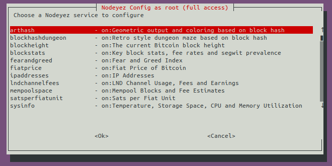
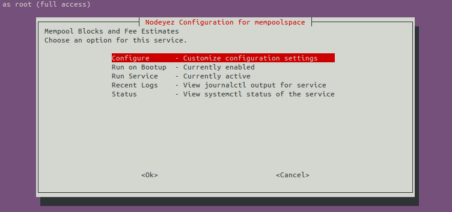
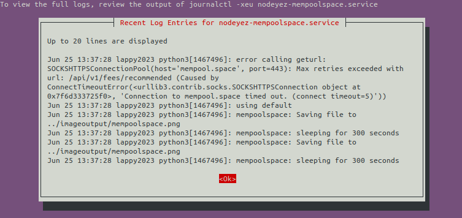
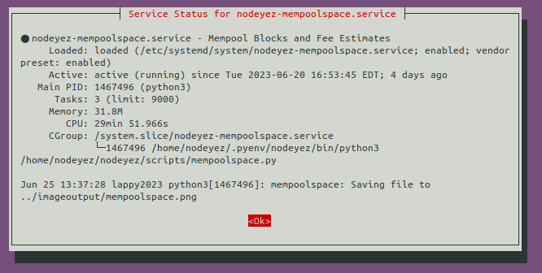

# Nodeyez-Config

The Nodeyez-Config tool attempts to encompass most of the configuration needs
you may have with Nodeyez.  It can show you a list of all the services available,
and allow you to drill down into the detailed configuration options.

## Installing the tool

If you installed Nodeyez using the [Quick Start](),
then the tool was installed and may be run from the terminal.  If you are doing a
manual install, then run this command to copy to the bin folder

```sh
sudo cp /home/nodeyez/nodeyez/scripts/nodeyez-config /usr/local/bin
```

## Launching the tool

To simply view settings, you should be able to run the tool as any user

```sh
nodeyez-config
```

But to make configuration changes, or start/stop services, you'll want to
run it with sudo privileges

```sh
sudo nodeyez-config
```

## Service Listing

When you run the tool, you'll be presented with a list of services that Nodeyez recognizes



For convenience, activated services are presented at the top with an 'on' indicator in the description field.

The title bar for the window provides an indication of what context you are running the configuration tool under. The tool should be run with effective root access to enable/disable services or start/stop them.  Similarly, either root or nodeyez group access if you want to make configuration changes.

Use arrow or other navigation keys to move through this list and press &lt;ENTER&gt; to confirm a selection.  Pressing &lt;ESC&gt; will back out of menu choices.

## Service Options

Upon selecting a service, a list of choices specific to that service will appear.



The Configure option for viewing and setting properties for the script is only available for those services that have configuration settings.

If you are running the nodeyez-config tool with root privileges, then you'll see the Run on Bootup and Run Service options. Choosing them will toggle their state.

The Recent Logs option will report the most recent 20 lines of log entries which may be useful for diagnostics if something does not appear to be working as expected.



In the above example, the mempoolblocks service could not start because a dependency in the service script failed.

If the service is running, then you'll also be presented with the option to view the Status of the service.



## View Properties

When you choose to customize configuration settings for a service, you'll be presented with the properties that can be configured, and their current values.


Property values are truncated if they are overly long to try to fit within the dialog window space.

Sensitive values such as passwords, authorization tokens and api keys will be treated as passwords and have their values "starred out".  The only way to view their cleartext value is to view the json configuration file directly.

Some configuration settings have nested options. In the example above, at the bottom of the list are choices to set the definitions of two different nested choices.

## View Nested Item

If the nested item is an array of multiple values, you'll see the listing of current entries.  


You may navigate to an entry to view details and modify, or choose the Add option if you want to make another definition.

When editing an item within a nested list, the configuration is similar to configuring properties.


Here, there is an option at the bottom of the list tha allows for deleting the item.

The title bar also provides for context of which item we are editing, and follows a JSONPath like descriptive format.

## Making Changes

If you press &lt;ENTER&gt; on a property, it will then present you with the option to modify its value.

The screen depicted will vary based on the property type.

Here is a common input for strings and numbers.  If the field is a sensitive field (passwords, authorization tokens and api keys), the value will be starred out.


The value will be prepulated with the current value for the property.

A description of the property is presented, and where applicable, information about the default value is given.

Validation rules are in place for any property that is a number (whole numbers or real), defined as a color, a boolean, or restricted to a list.

Make your changes, and confirm them by pressing &lt;ENTER&gt; or cancel by pressing &lt;ESC&gt; to go back.


---

[Home](../) | [Back to Running Services at Startup]()
